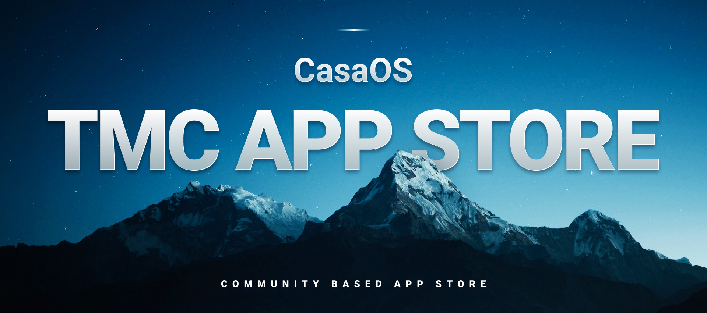

[](https://github.com/mariosemes/CasaOS-TMCstore/tree/traffic#-total-traffic-data-badge)
[](https://github.com/mariosemes/CasaOS-TMCstore/tree/traffic#-total-traffic-data-badge)
[](https://github.com/mariosemes/CasaOS-TMCstore/tree/traffic#-total-traffic-data-badge)
[](https://github.com/mariosemes/CasaOS-TMCstore/tree/traffic#-total-traffic-data-badge)

# ⭐ CasaOS TMC Community App Store
```Believe it or not, but yet another CasaOS Community App Store based mostly on my usage and apps.```

### What is CasaOS?
[CasaOS](https://www.casaos.io/) dances to its own tune, and it's not your run-of-the-mill operating system. Think of it as your very own home cloud maestro, choreographed within the Docker ecosystem and designed especially for your cozy abode. Its mission? Crafting the world's most effortlessly elegant, user-friendly home cloud system you've ever laid eyes on.
<br /><br />
**You can find me and many other great community members on the [official CasaOS Discord server.](https://discord.gg/Gx4BCEtHjx)**

[](https://www.casaos.io/)
[](https://github.com/IceWhaleTech/CasaOS)
[](https://discord.gg/Gx4BCEtHjx)

<br />

## ⚠️ Warning!

Please be aware that this Appstore is exclusively supported on CasaOS version 0.4.4 and above. If you are currently using an older version, you will need to upgrade to access this functionality. To upgrade your CasaOS version, please [click here](https://wiki.casaos.io/en/guides) for detailed instructions.

<br />

## ⬇️ Download URL:

    https://github.com/jclaudan/CasaOS-TMCstore/archive/refs/heads/main.zip

<br />

## 🔥 How to install:


<br />

## 📱 Apps:

| App | Thumbnail |
| :-- | --- |
| <h2> Red Discord Bot</h2> [](https://github.com/Cog-Creators/Red-DiscordBot) [](https://github.com/Cog-Creators/Red-DiscordBot) <br /> Custom for add bot video streaming Red is a fully modular bot – meaning all features and commands can be enabled/disabled to your liking, making it completely customizable. This is a self-hosted bot – meaning you will need to host and maintain your own instance. |  |
